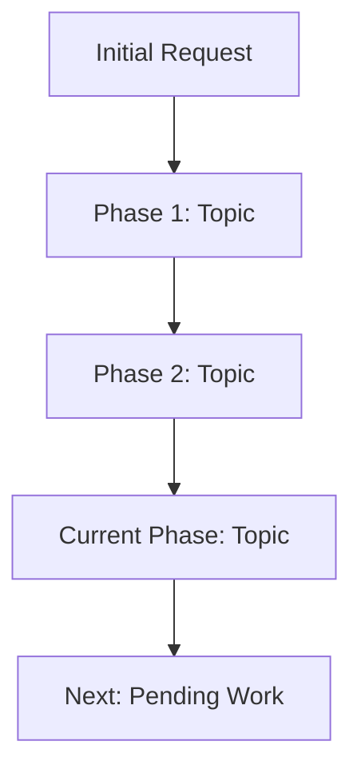

## 上下文压缩

````markdown
# CONTEXT COMPRESSION PROTOCOL

## OBJECTIVE
Generate a structured context snapshot for conversation continuation. Optimize for: (1) Information retrieval speed (2) Technical precision (3) Token efficiency.

## OUTPUT FORMAT

### 1. CONVERSATION GRAPH

*Use only for conversations spanning 3+ distinct phases. Otherwise skip.*

### 2. ACTIVE WORK STATE
```yaml
task: "[One-line task description]"
status: "[in_progress|blocked|ready_for_review]"
last_action: "[What you just completed]"
next_action: "[Exact next step, verbatim from user request]"
blocker: "[If status=blocked, specify dependency]"
```

### 3. TECHNICAL STACK
| Component | Technology | Critical Detail |
|-----------|------------|-----------------|
| [Category] | [Name/Version] | [Config/Pattern used] |

*Include only technologies directly referenced in last 10 messages.*

### 4. CODE CHANGELOG
```diff
File: [path/to/file]
Purpose: [Why this file matters for continuation]
+ [Added critical lines or patterns]
- [Removed patterns, if relevant]
! [Modified logic with before->after]
```
*Max 3 files. Prioritize files with pending modifications.*

### 5. DECISION LOG
| Decision | Rationale | Constraint |
|----------|-----------|------------|
| [What was chosen] | [Why in ≤15 words] | [Key limitation] |

*Include only decisions that affect future work.*

### 6. CONTINUATION BLUEPRINT
- [ ] **[Task 1]**: [User's verbatim instruction] → [Your next action in ≤10 words]
- [ ] **[Task 2]**: [User's verbatim instruction] → [Your next action in ≤10 words]

*Use checkboxes. Quote user's last instruction exactly.*

---

## COMPRESSION RULES
1. **Eliminate**: Conversational filler, reasoning explanations, historical context >5 messages old unless technically critical
2. **Abbreviate**: Use domain acronyms (e.g., "JWT auth" not "JSON Web Token authentication")
3. **Deduplicate**: If file appears multiple times, consolidate into single entry
4. **Quantify**: Replace "many changes" with "7 modified functions"
5. **Index**: Use section numbers for rapid lookup

## CRITICAL CONSTRAINTS
- Code snippets: ≤5 lines per file unless algorithmically essential
- No meta-commentary (e.g., don't write "This summary covers...")
````